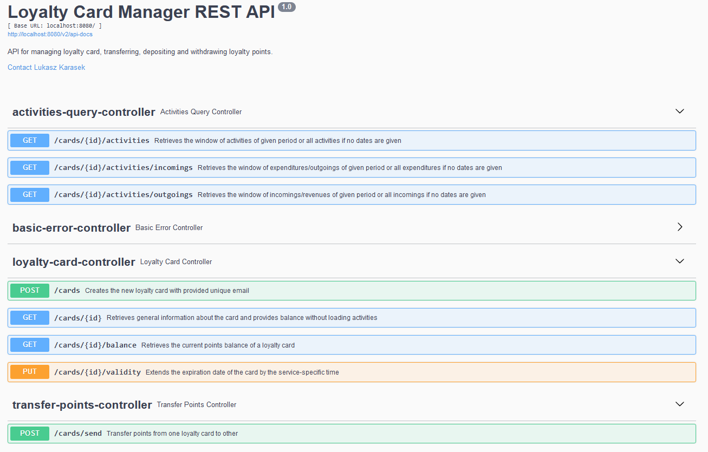

# Loyalty card wallet API

## Table of contents

* [General info](#general-info)
* [Status](#status)
* [Technologies](#technologies)
* [How to run](#how-to-run)
* [Docs](#docs)  
* [Requirements](#requirements)


## General info
This application is a loyalty card manager designed in hexagonal architecture with rich domain model. The card model
handles card state and all card activities by defining logic of core behaviors such as withdrawal, deposit, transfer in,
transfer out. Loyalty card operations require validation based on its properties and current state and other business
rules.

## Status
Some of the future plans are:
* Implement card activation/deactivation/soft delete
* Implement optimistic locking whilst performing card transactions

## Technologies

Project is created with:

* Java 17
* Spring Boot version 2.7.1
* Spring Data JPA
* Spring HATEOAS
* Postgresql
* Liquibase
* Swagger
* Docker
* Lombok
* MapStruct
* Testcontainers


## How to run

To get this project up and running, navigate to root directory of an application and execute following commands:

* Create a jar file.
```
$ ./gradlew clean build
```

* Then build docker image using already built jar file.

```
$ docker-compose build
```

* Run whole setup using docker compose.

```
$ docker-compose up
```


## Docs
After following above steps go to the endpoint [swagger-docs](http://localhost:8080/swagger-ui/) to view the REST API docs.
Domain documentation is available after generating javadocs for domain package.

Something similar to this should appear:



## Requirements

* JDK 17
* Docker